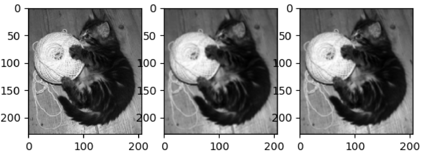
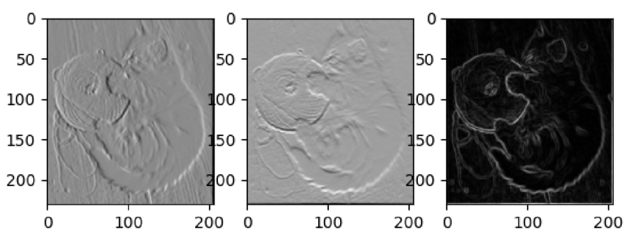
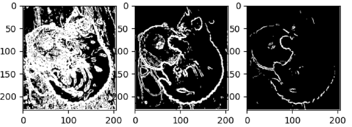
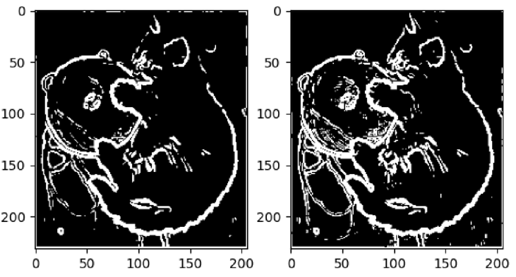
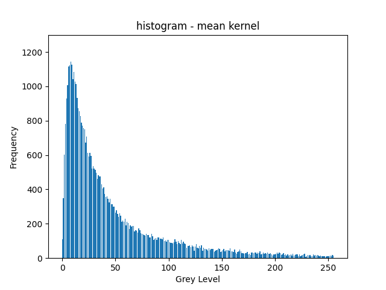
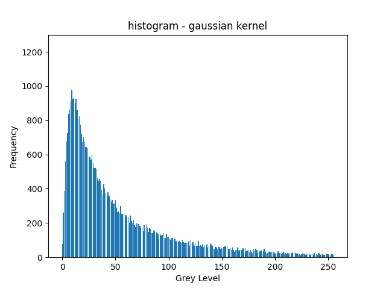

# Computer Vision Coursework 1 - Detecting edges with convolution & image gradients
- author: Eu-Bin KIM
- date of submission: 16th of April 2021

## Task 1 - implementing a convolution function

```python
def pad(img: np.array) -> np.array:
    # 1. build a placeholder.
    img_padded = np.zeros(shape=(img.shape[0] + 2,
                                 img.shape[1] + 2))
    # 2. copy and paste inside the "box"
    img_padded[1:-1, 1:-1] = img
    return img_padded
```

A python function for padding an image is implemented at line 16-25 in the `task_1_convolve.py` script.
We need a padding function because we must pad an image before convolving a kernel over it 
if we were to maintain the dimensions of an image. Otherwise, the size of the image will be reduced
according to the kernel size. The code snippet above shows how the `pad()` function is implemented.

```python
# the kernels
# not weighted, normalised. (adds up to 9)
MEAN_KERNEL = np.ones(shape=(3, 3)) / 10  
# weighted, normalised (adds up to 8)
WEIGHTED_MEAN_KERNEL = np.array([[0.5, 1, 0.5],
                                 [1,   2,   1],
                                 [0.5, 1, 0.5]]) / 8 
```

A python function for convolving an image with a kernel is implemented at line 28-56 in the same script.
The `convolve()` function makes use of two kernels, as illustrated in the code snippet above; the `MEAN_KERNEL` is a
 3 by 3 matrix that only consists of 1. the `WEIGHTED_MEAN_KERNEL` is also a 3 by 3 matrix, but the values of its elements
are set in such a way that the resulting mean takes more into account the center than the outskirts. This is used
under the assumption that neighborhoods share similar values with the center.


> {width=400px}

We can smoothen an image by convolving it with the two kernels. As can be seen in **Figure 1**, the mean-convoluted
kitten looks much blurrier than the original kitten. the weighted-mean-convoluted kitten is also blurry, but this looks slightly
sharper than the mean-convoluted one. This is because weighted-mean-convolution can anti-alias the edges more than the
mean-convolution. Since anti-aliasing effect is ideal for edge detection, we choose the weighted one as the kernel to use. 
More on this justification will be discussed in the Task 4 section. 


## Task 2 - computing the gradients

```python
# convolving an image with SOBEL_KERNEL also approximates the differentiation,
# but the gradients are weighted towards the center.
SOBEL_KERNELS = (
    np.array([[-1, 0, 1],
              [-2, 0, 2],
              [-1, 0, 1]]),
    np.array([[-1, -2, -1],
              [0,   0,  0],
              [1,   2,  1]])
)
```
As for the kernels to be used for computing the image gradients, horizontal & vertical `SOBEL_KERNELS` were defined and used,
as illustrated in the code snippet above. As with Prewett kernel, we can approximate the first derivatives of the pixel values
along the x & y axes by convolving an image with Sobel kernels in the axes accordingly. The gradients are computed with 
`compute gradients()` function at line 33-52 in `task_2_compute.py` script.


>{width=400px}

```python
def compute_magnitude(x_gradients: np.array, y_gradients: np.array) -> np.array:
    """
    sqrt(x_g**2 + y_g**2)
    """
    return np.sqrt(np.power(x_gradients, 2) + np.power(y_gradients, 2))
```

What the first derivatives reveal are the horizontal and vertical edges of an image, as we can see from **Figure 2**.
The square root of the sum of the gradients to the power of 2 is then the gradient magnitude of the image,
which reveals all the edges in both directions.


## Task 3 - detecting the edges with thresholding

>{width=400px}

After we compute the gradient magnitude image, we can then detect the edges of the image by thresholding the
magnitude. In order to carry out an experiment to optimize the threshold, we first convolve the image with a
 weighted-mean kernel, compute the horizontal & vertical gradients of the convoluted image with Sobel kernels, compute
the magnitude image from the gradients, threshold the magnitude with a certain threshold, and repeat 
the whole process until we find an optimum number for the threshold. As shown in **Figure 3**, when the threshold is
too small (i.e. 30), most of the pixel values remain large, and thus no edges are clearly revealed. On the other hand,
when the threshold is too large (i.e. 240), the edges surrounding the back & the head of the kitten are hardly identifiable.
109 was found to be optimum value for the threshold, as it well reveals the edges around the kitten as well as around
the thread the kitten is holding, while those in the wood-grains are well suppressed.

## (Conclusion) Task 4 - comparing the mean kernel with the weighted kernel


> {width=400px}

> {width=250px}
> {width=250px}

> The histogram of the gradient magnitude of the mean-convoluted image (left) and that of the weighted-mean-convoluted image 

The weighted kernel is more suited for edge detection than the non-weighted kernel because it can better anti-alias the edges.
The anti-aliasing effect is well reflected in the histograms above; There are less low-level pixels and more mid-level pixels
when we use a weighted-mean kernel than when we use a non-weighted one, which implies that the smoothened edges are more
salient in the former than in the latter. As such, **Figure 4** shows that there are more edges obtained from a weighed-mean-convoluted
image than there are edges obtained from a simple mean-convoluted image.
