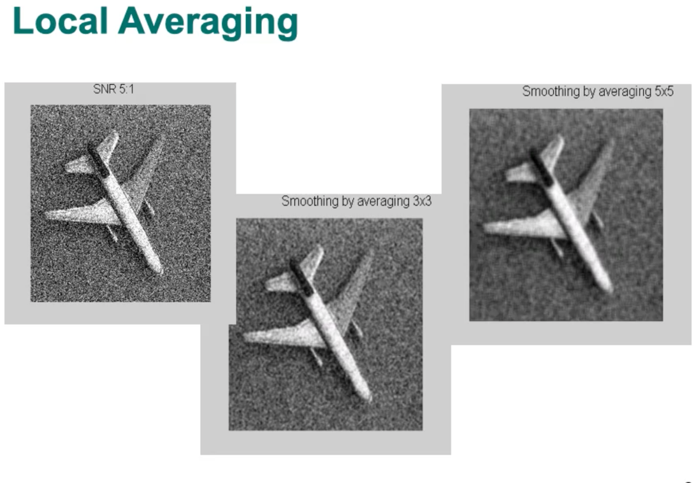
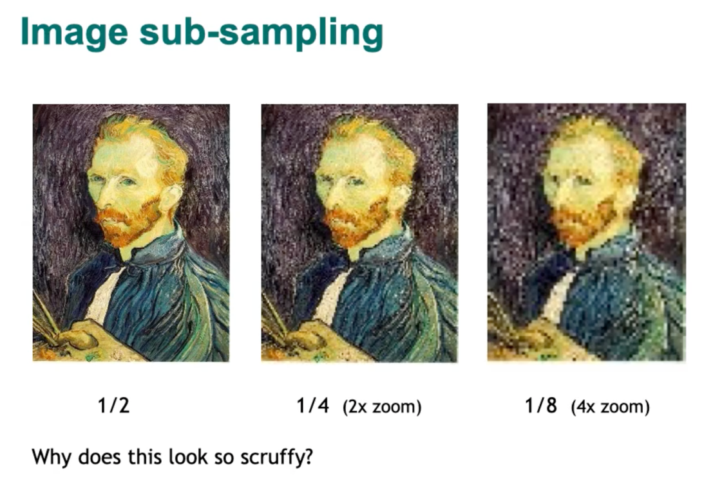
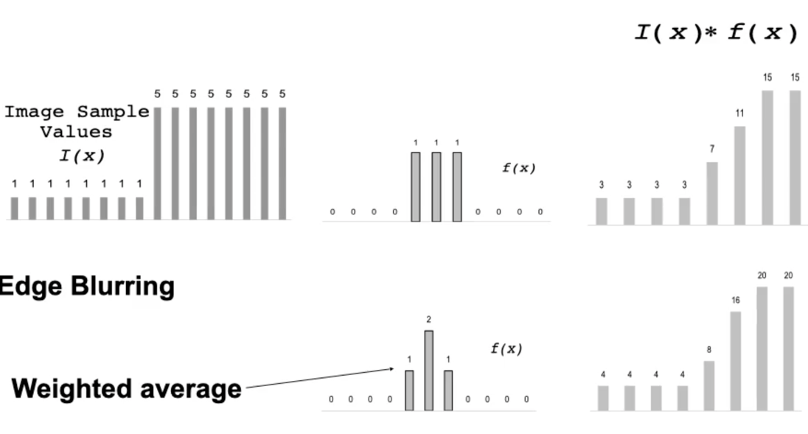
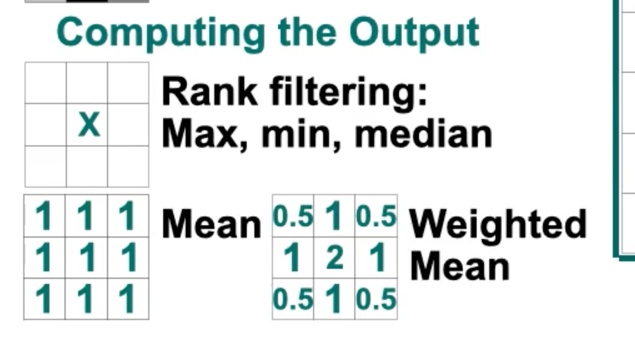
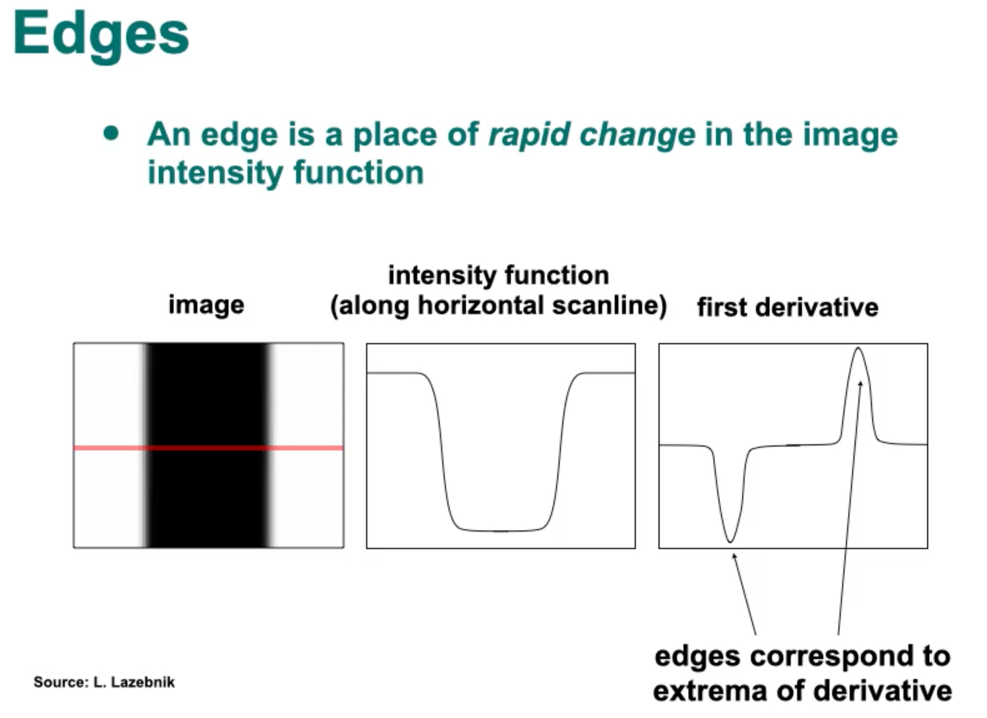

## Task 1 - implement a convolution function

> What am I supposed to do?
1. write `convolve()` function.
   - you should pad the edges of the input image with zeros. (how did I do this?)
   - we should perform explicit looping over it. (2)
   - start with a 3 by 3 convolution filter. (optional: parameterize the size of the filter as n)
2. compute the effect of taking (this should add up to the conclusion) -> should be included later in the report:
   - average
   - weighted-average smoothing kernels for the convolution
    
> What does it mean to perform "convolution" on an image with "structuring element"?

THat means to reduce the image into a smaller one, while maintaining important features of the original one.

For example, any examples from the lectures? The "structuring element" probably
refers to a convolution filter.

> Why do I want to perform a convolution on `kitty.bmp`? 

To extract some features? Yes. If you look at the description for task 2:
- compute the "horizontal and vertical gradient images"
- find the "edge strength image", given by the gradient magnitude

(from the lecture). If we had 9 different images with different noises,
we can denoise them into a single image by averaging over them. But we don't always have
enough samples to be used. Alternatively, we could use convolution to denoise the image,
given only the image itself. 

> 
> Here is an example of denoising an image with (local) spatial averaging with a 3 by 3 filters and  a 5 by 5 filter.

> 
>  an example scenario where we may need convolution: image sub sampling 

> Why does spatial averaging work?

Because the neighbourhood have similar values to each other. We are exploiting that feature.

Notice that we lose more information with a bigger filter. The assumption gets increasingly invalid as
the filter gets larger.

> Wait, but wouldn't "denoising" make the edges less salient? How would this help?

That assumption does not hold true for edges of course.
Surely, the edges on the kitty would become less salient, but so would those on the wooden floor.

> 

Both average kernel and weighted average kernel result in smoothing out the edges.
But resulting image with weighted average kernel has a "rather smoother contour". Which
is a better property for edge detection. ("keep this in mind"). 

> Why do we pad the image? 

Because otherwise, the image won't be a square...?

> How do I implement `convolve()`?

Look it up on the lectures maybe?

this repo should help:
- https://github.com/ashushekar/image-convolution-from-scratch/blob/master/convolve.py

> How do I implement `pad()`

This, look it up on the lectures.

use np.pad() function.

> Wouldn't the image get smaller after the convolution? How do we detect edges of the original
image then?

That's why you do padding. pad 1 zero pixel before and after the boundaries. (and pad the four corners as well)

> What is Sobel or Prewitt kernel? What do they have to do with mean and weighed mean kernel?

Are they mentioned in the lectures somehow?

> 
> max filter, avg filter (weights are just 1), weighted avg filter (more weights on those close to the center).

> What should you do if the sum of the kernel is 0 You can't divide by zero; You can't 
> array / array.sum() ?

## Task 2 - **calculate** the edge strength image from the gradient magnitude image.

> what am I supposed to do?
- compute the horizontal and vertical gradient images
- from these, compute the gradient magnitude image
- for that, calculate the edge strength image (2)
- maybe visualise before and after all of these

> What are the formulae for horizontal & vertical gradient of an image?

> How do we combine that into a "gradient magnitude image"?

> How do we get "edge strength image" from a gradient magnitude image?

## Task 3 - **detect** the edges of the cat

> what am I supposed to do?

- detect the major edges by **thresholding** the edge strength image (2)
  - may find it useful to plot histogram for the edge-strength image
    - why might this be useful though?
  - find the threshold that gives the edges of the cat, but those of fur and wood-grain.  
  - visualise the process, include in the report. 

> what are "edges", numerically speaking?

> 

They are the regions where the gray level is **changing rapidly**. (edges & convolution, part1).
Mathematically speaking, these are the regions at which the first derivative 
of the intensity function reaches its extrema. 

> Why do we need to convolve an image before detecting the edges?

> How do we detect horizontal edges?

Calculate the gradients along the horizontal axis.

> How do we detect vertical edges?

Calculate the gradients along the vertical axis.

> How do we find a great threshold value?

By looking at the histogram, it seems. It should have "dips" in it.

Someone has tried using cv2 trackbar to find a good value interactively.

> How do we implement thresholding?

Someone has used the "Simple method" from code snippets.

Use the Snippet 09, the purpose of which is to "Threshold a greyscale image".

## Task 4 - **compare** the edges obtained with a mean filter vs. those obtained with a weighted mean filter

> what am I supposed to do?
- compare edge strength images when using a weighted average kernel (2)

## Conclusions

> what am I supposed to do?

- a report, that includes conclusions from each task. 
